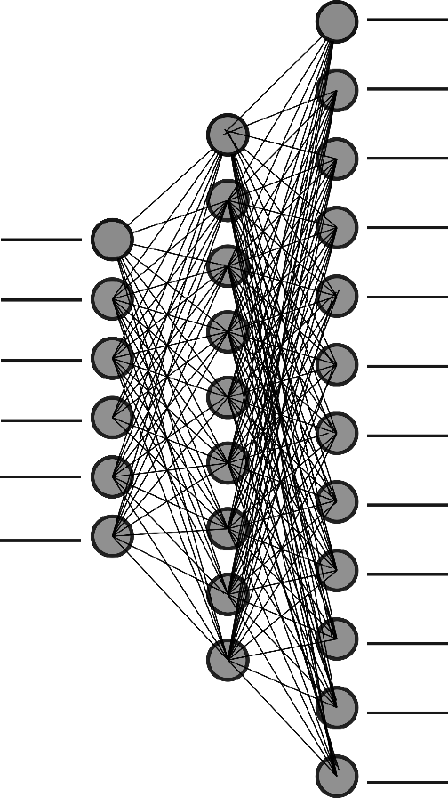

# Binder Lab
## word2vec and other analysis

This is a repo to try and describe and document a rotation project. Central to research is **conveying** results to others in the field with nice visuals.
### Relating Sensory and Latent Vector spaces

 It is first worth looking at what if there is a linear relationship between the two spaces. This is looked at in the [notebook_plot.ipynb](notebook_plot.ipynb). In short, the assumption is that **X . M = Y** where X and Y are [535, 65] and [535, 300] respectively.

 Following a simple linear analysis, I looked into a feedforward neural network to relate the spaces.

 

While only one hidden layer is illustrated above, I explore several models in the [relating_spaces.ipynb](relating_spaces.ipynb).

Ultimately, due to the lackluster results, I decided to take a new approach. To this end, I initially performed a t-SNE embedding, which is visualized at the link below. The link is to an interactive notebook.

[Plotly Link](https://plot.ly/~famousshooter98/16/notes-this-notebook-was-made-just-to-vis/)

For machine learning, I used a space reduced in the same manner, combined with a feed forward neural net.

### Second Project
